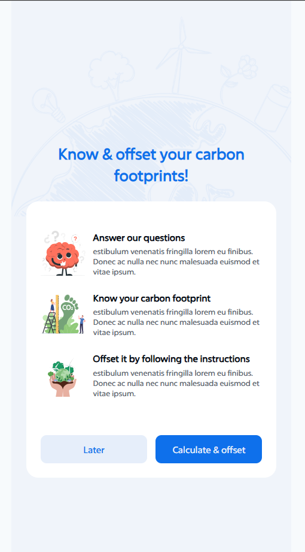
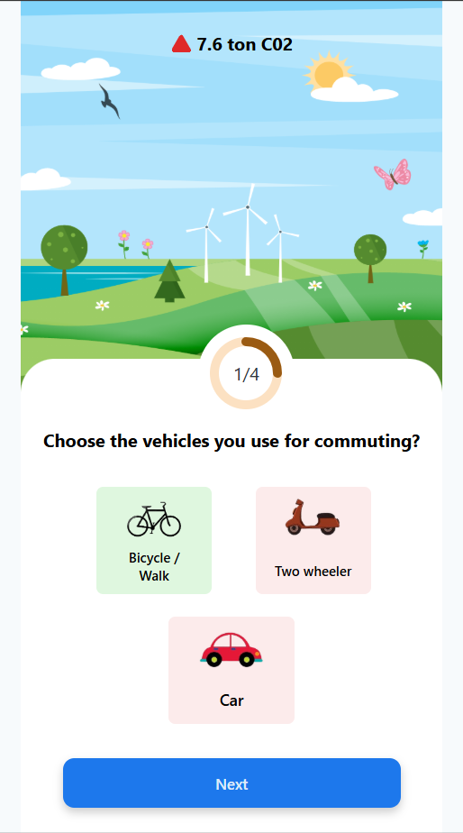
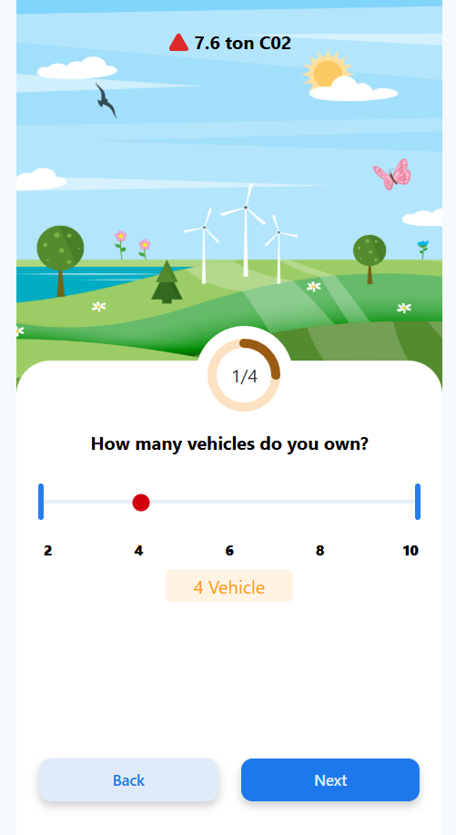
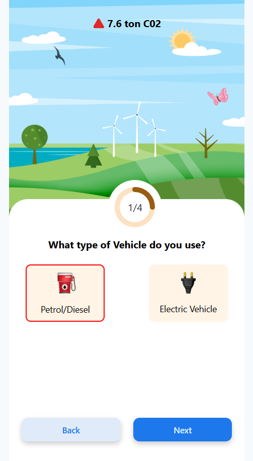
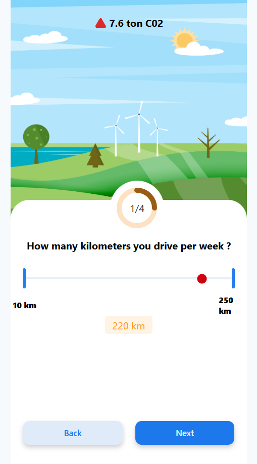
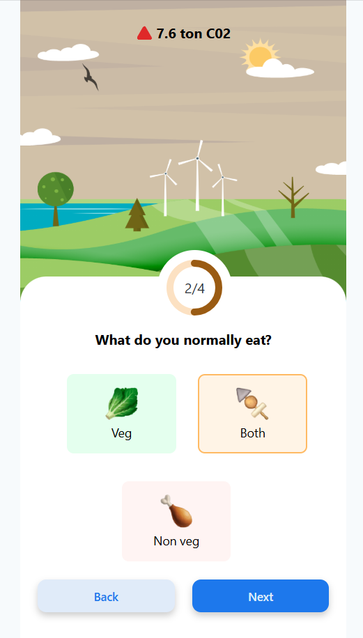
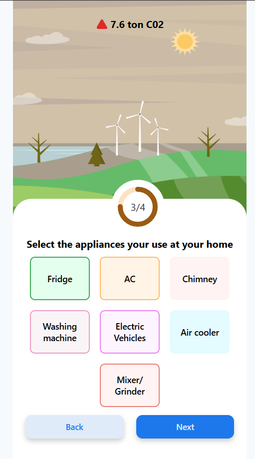
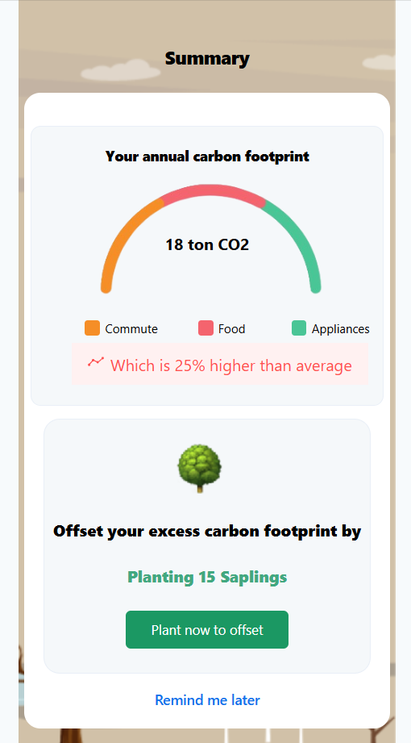
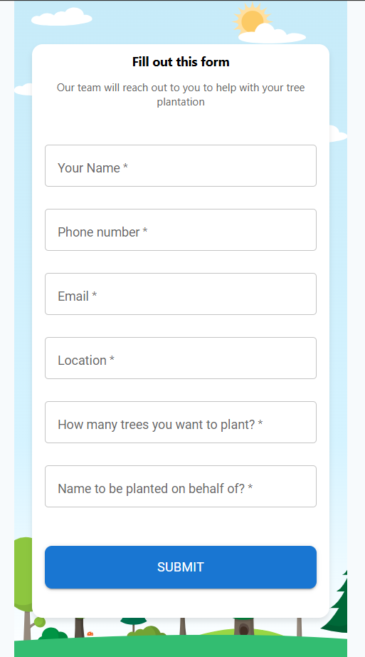

# 🌿 Karma Calculator

Welcome to the **Karma Calculator** – a personalized carbon footprint tracker built to create environmental awareness and promote green living. This mobile-first application collects lifestyle data, calculates your carbon emissions, and provides actionable suggestions along with an opportunity to request tree planting in your name.

---

## 📱 Optimized for Mobile Users

Designed especially for mobile screens, Karma Calculator delivers a beautiful, interactive, and intuitive UI to ensure a smooth user experience across all devices.

---

## 📚 Project Overview

The **Karma Calculator** collects key lifestyle inputs including:

- 🚗 Vehicle usage (type, fuel, and travel distance)
- 🍽️ Food habits (Vegetarian / Non-Vegetarian)
- ⚡ Electrical appliance usage & current consumption
- 🧍 User/Family-based tracking

With this data, it visualizes the **calculated carbon footprint** using an interactive graph, and:

- 🧠 Suggests eco-friendly practices to reduce carbon output
- 🌳 Opens a form to request **tree plantation** in the user's name

---

## 🌐 Live Project

👉 Visit: **[www.jaisakthipapers.com](https://www.jaisakthipapers.com)**

---

## 🛠️ Tech Stack

### Frontend:
- **React** ⚛️
- **Tailwind CSS** 💨
- **Material UI (MUI)** 🎨
- **AOS (Animate on Scroll)** ✨

### Backend:
- **Node.js** 🟢
- **Express.js** 🚀
- **MySQL** 🗄️
- **Sequelize ORM** 🔗

---

## 🌟 Features

- 📊 **Real-time Carbon Footprint Calculation**
- 🌱 **Personalized Suggestions** to Reduce Carbon Output
- 🧾 **Tree Plantation Request Form**
- 🎯 **Attractive Graphical UI with Animations**
- 📱 **Mobile-First Responsive Design**

---

## 📸 Screenshots

### 🏠 Home Page












### 📈 Carbon Emission Graph


### 📝 Tree Plantation Request Form



---

## 🚦 How to Run Locally

```bash
# Clone the Repository
git clone https://github.com/yourusername/Karma-Calculator.git

# Navigate to Frontend
cd Frontend

# Install dependencies
npm install

# Start the development server
npm run dev
```

Then visit: [http://localhost:5173](http://localhost:5173)

---

## 📬 Contact

- **Developer:** Yogesh Kumar S  
- **Email:** yogeshkumar.s.radha@gmail.com  
- **LinkedIn:** [https://www.linkedin.com/in/yogeshkumar2005/](https://www.linkedin.com/in/yogeshkumar2005/)  
- **GitHub:** [https://github.com/Yogeshkumar200516](https://github.com/Yogeshkumar200516)

---

## 📜 License

This project is licensed under the **MIT License**.

---

⭐ *If this project inspired or helped you, don't forget to leave a star!* ⭐

🚀 **Let’s calculate your karma and heal the Earth, one tree at a time!** 🌍

