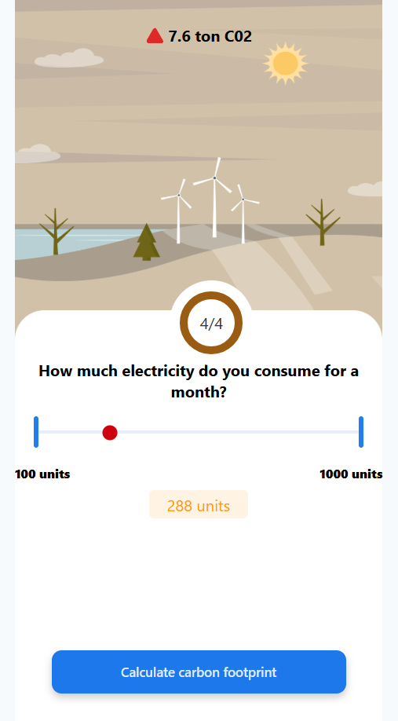

# 🌿 Karma Calculator – Track. Reflect. Act.

Welcome to **Karma Calculator** — a mobile-first web app that helps individuals and families **understand their carbon footprint** based on daily habits and **take real-world action** like planting trees to offset it. 🌍🌱

> 📱 Optimized for Mobile | 🎨 Stunning UI/UX | 🌐 Eco-Conscious Tech

---

## 🔍 Project Overview

**Karma Calculator** is designed to:
- Collect eco-impacting lifestyle data from users (like food habits, vehicles, and energy usage).
- Calculate their **carbon footprint**.
- Display the result visually through **interactive graphs**.
- Suggest **customized ways to reduce emissions**.
- Allow users to **request tree planting** in their name or for their family through a sleek and responsive form.

> 🌟 **Your daily choices matter — Know your impact, reduce it, and give back to Earth.**

---

## 🛠️ Technologies Used

### **Frontend:**
- React.js ⚛️
- Tailwind CSS 💨
- Material-UI (MUI) 🧩
- AOS (Animate on Scroll) ✨
- Custom graph libraries & form validation tools

### **Backend:**
- Node.js 🟢
- Express.js 🚀
- MySQL 🗃️
- Sequelize ORM 🔗

---

## 📱 Key Features

- ✅ **Mobile-First Design:** Built especially for smartphones with seamless responsiveness
- 🚗 **Vehicle Emission Data:** Fuel type, number of vehicles, and travel distance
- 🥗 **Food Habits Tracking:** Veg vs Non-Veg impact evaluation
- 💡 **Appliance Energy Use:** Appliance count & electricity consumption/month
- 📊 **Live Carbon Footprint Graph:** Dynamic visuals of carbon emission metrics
- 🌳 **Tree Planting Request:** Submit form to plant trees in user/family name
- 💬 **Tips & Suggestions:** Personalized advice to reduce footprint
- 🧠 **Educational & Actionable:** Encourages eco-action beyond just analytics

---

## 🧾 User Flow

1. **Fill Personal Impact Details**
2. **View Calculated Carbon Footprint**
3. **Read Suggestions to Improve**
4. **Submit Tree Planting Form**
5. **Feel Good, Repeat.** ♻️

---

## 📸 Screenshots

*Add your mobile UI screenshots here in this format:*

```md
1. 
2. 
3. 
4. 
5. 
6. 
7. 
8. 
9. 
10. 
11. 
```

---

## ⚙️ How to Run Locally

```bash
# 1. Clone the repository
git clone https://github.com/Yogeshkumar200516/Karma_Calculator.git

# 2. Navigate to the Frontend
cd Frontend

# 3. Install frontend dependencies
npm install

# 4. Start frontend development server
npm run dev

# 5. (In another terminal) Start backend server
cd ../Backend
npm install
node index.js

# Open the app on:
http://localhost:5173
```

---

## 📬 Contact

- **Developer:** Yogesh Kumar S  
- **Email:** [yogeshkumar.s.radha@gmail.com](mailto:yogeshkumar.s.radha@gmail.com)  
- **LinkedIn:** [linkedin.com/in/yogeshkumar2005](https://www.linkedin.com/in/yogeshkumar2005)  
- **GitHub:** [github.com/Yogeshkumar200516](https://github.com/Yogeshkumar200516)

---

## 📄 License

This project is licensed under the **MIT License**.  
Use freely, modify ethically, and contribute to a greener future. 🌍

---

## 🌟 Support & Acknowledgment

If this project inspired you to live more sustainably or build more consciously, please ⭐ it on GitHub and share it with others.

> 🌱 **Together, we can make the world greener — one karma at a time.**
